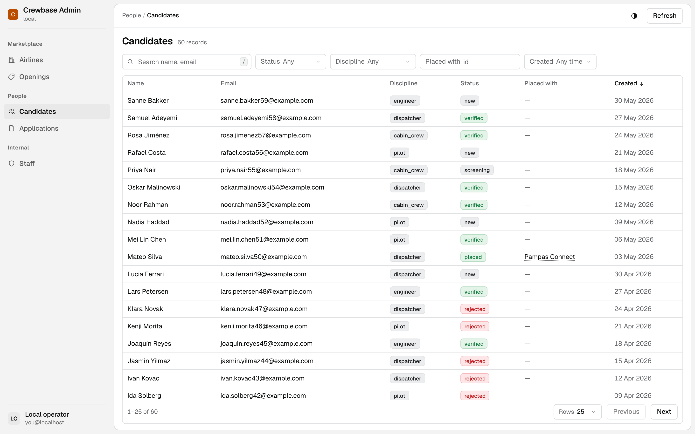
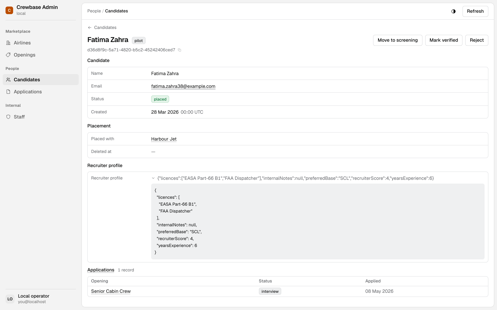

# RePanel

**A first-class admin for every stack — your coding agent is the adapter.**

You built the app. What you did not build is the place where somebody looks up
a customer, works out why an order is stuck, and moves a status without opening
a `psql` window at two in the morning. That place is a second application, and
nobody wants to own a second application.

So don't. Point your coding agent at your repository. It reads the schema, the
enums, the endpoints, the columns that are secret and the ones that are merely
noisy, and writes a **definition** — a small JSON description of the admin your
app deserves. RePanel renders it: tables, search, filters, detail pages,
relationships, safe actions, dark mode, the lot.

The definition lives in your repo, in your review, under your history. The
runtime is ours to keep beautiful. Nobody writes a screen.

---

## Sixty seconds

**1 · Run it where your code lives.** No account, no signup, nothing leaves your
machine.

```bash
npx repanel dev
```

The first run finds no definition and tells you exactly what is missing. That is
your cue. *(Preview: `repanel` is not on npm yet. Until it is, the walk below
runs the same command from a clone.)*

**2 · Hand it to your agent.** Claude Code, Codex, Cursor — whatever you already
talk to.

```text
Read this app's schema and write a RePanel definition into repanel/.
```

**3 · Run it again.**

```console
$ npx repanel dev

  ✓  Crewbase Admin — 5 resources from repanel/, valid against definition schema 0.1.

  Admin      http://127.0.0.1:5170/a/local/
  Database   localhost:5433/crewbase (from .env)
  Watching   repanel/

  ⚠  Actions are signed with a secret generated for this run…

  ✓  No account and no RePanel network calls: the only connections
     this process opens are the database above and the endpoints your
     actions declare.
```

(That run is Crewbase, the reference application below. Yours will name your
app and your resources.)

Open the address. That is the real admin, reading your own database, on your own
machine. Leave it running while your agent works: every save under `repanel/` is
re-checked, a good one reloads the page, and a broken one appears as an overlay
over the admin that was already there — so a bad edit costs you nothing.

**4 · When you want it somewhere other than your laptop.**

```bash
repanel link      # sign in through the browser, pick a project, point it at your database
repanel deploy    # submit the definition, get back the address of the admin it describes
```

`link` reads `DATABASE_URL` from your environment, shows it to you with the
password taken out, and sends it only once you have said yes. It is never
printed and never written down. Both commands talk to a RePanel deployment —
today that means one you run yourself ([CONTRIBUTING](CONTRIBUTING.md#repanel-itself));
hosted Cloud is in the preview box below.

### Rather see it before you point it at your own data?

**Crewbase** is the reference application: a small aviation staffing
marketplace with about two hundred rows and every trap an admin usually walks
into — a password hash, a soft delete, JSONB full of working notes, and a status
with a business rule behind it. From a cold clone:

```bash
git clone https://github.com/repanel-ai/repanel.git && cd repanel
pnpm install && pnpm -r build

cp examples/crewbase/.env.example examples/crewbase/.env
docker compose -f examples/crewbase/docker-compose.yml up -d
pnpm --filter crewbase db:push && pnpm --filter crewbase seed

pnpm --filter crewbase exec repanel dev         # → http://127.0.0.1:5170/a/local/
```

Node ≥ 22, pnpm 9 and Docker, and a few minutes — most of it install. The
last command finds the database in `.env`, shows it to you and asks before
connecting; press Enter. What comes up is the two screens below.

---

## What comes out



Sixty candidates. The search box, the four filters and the sort all come out of
one `views.table` block — nobody positioned anything, nobody wrote a query. The
green and the red are not the runtime guessing what `verified` means: an enum states
how grave each of its values is, or every value renders quiet. `deleted_at` is
marked hidden, so it can never become a column, a filter or a sort.



One record: sections in the order the definition asked for, a foreign key
resolved to the airline's name, the JSONB opened up rather than dumped, and the
related applications underneath. The three buttons move a status — a guarded
write, because that transition has no rule behind it. Over on **Airlines**,
`Approve` instead calls Crewbase's own endpoint with a signed request, because
that one *does* have a rule and rules belong to your application, not to
your admin.

Never shown anywhere: `users.password_hash`. A field marked `sensitive` cannot
be a column, a filter, a sort, a search field or part of an action's URL — not
by convention, but because the validator refuses a definition that tries.

---

> ### Public preview
>
> RePanel is pre-1.0 and says so out loud. Everything under the first heading
> works today; everything under the second is not built yet, and is linked to
> the task that builds it.
>
> **Working today**
>
> - **Read, thoroughly.** Tables with search, enum / relation / date-range
>   filters, sorting and pagination; detail pages with sections, resolved
>   relationships and related lists; eleven field types including inspectable
>   JSON; `sensitive` and `hidden` containment enforced by the validator.
> - **Actions, two kinds.** A guarded write to one enum or boolean field, and a
>   signed call to an endpoint in your own application — with confirmation copy
>   and per-record visibility rules.
> - **The local loop.** `repanel dev` serves the real runtime against your own
>   database with no account, no project and no RePanel network call, and
>   re-checks the definition on every save.
> - **The cloud rungs.** `repanel link`, `repanel deploy`, and an MCP server with
>   five tools for agents that would rather submit than write files.
> - **PostgreSQL**, and one database at a time.
>
> **Not yet**
>
> | | |
> |---|---|
> | Create and edit forms | [026](docs/tasks/026-forms-contract-engine.md) · [027](docs/tasks/027-forms-ui.md) |
> | Audit log — who did what, when | [028](docs/tasks/028-audit-log.md) |
> | Operator accounts and roles | [029](docs/tasks/029-operator-roles.md) |
> | Draft / published snapshots | [025](docs/tasks/025-publishing.md) |
> | Supabase and pooled connections | [030](docs/tasks/030-supabase-pooler.md) |
> | The connector, for databases we cannot reach | [031](docs/tasks/031-connector.md) |
> | MySQL, bulk actions, CSV, saved views | [the backlog](docs/BACKLOG.md) |
> | `repanel` on npm, and hosted Cloud | not yet published; run it from the clone above |
>
> Forms are the one people ask about first, and they are the very next thing
> built — in public, on this repository, rather than behind a launch date.

---

## Before you trust it with a production database

Two documents, both written for the sceptical reader rather than the
enthusiastic one:

- **[docs/THREAT-MODEL.md](docs/THREAT-MODEL.md)** — what RePanel holds, what
  each part of it can and cannot do, and a section that lists what is still
  *trusted* rather than *enforced*. Every claim names the thing that enforces
  it; a sentence with nothing behind it would be a promise, and a promise is not
  a control.
- **[docs/LICENSING.md](docs/LICENSING.md)** — the licence split in plain
  language, including the "our organization does not allow AGPL" answer. One
  sentence carries it: **what you build against is permissive; what we operate
  is copyleft.** [`LICENSES.md`](LICENSES.md) is the authoritative map.

Found something that should not be? [SECURITY.md](SECURITY.md) says how to tell
us.

---

## How it works

Five layers, and the interesting thing about them is who owns which.

```
  your application        your data, your rules, your endpoints
        │
        ▼
  your coding agent       reads the repository, writes the definition
        │                 (files on disk, or submitted through MCP)
        ▼
  the control plane       projects, connections, drafts, publishing
        │
        ▼
  validation              every key checked against the schema; a sensitive
        │                 field can never reach a place it could leak from
        ▼
  the runtime             tables, detail pages, actions, empty and error
                          states, light and dark, and the `/` that jumps to
                          search — ours, and never your problem
```

The definition in the middle is the whole deliverable. It states intent, never
layout — no component tree, no styling, no branching. A piece of Crewbase's,
with most of it cut away:

```json
{
  "key": "airlines",
  "labelField": "name",
  "fields": [
    { "key": "approval_status", "type": "enum", "values": ["pending", "approved", "rejected"],
      "tones": { "pending": "attention", "approved": "positive", "rejected": "critical" } }
  ],
  "actions": [
    { "key": "approve", "label": "Approve", "kind": "httpCall", "method": "POST",
      "url": "https://crewbase.internal/repanel/airlines/{id}/approve",
      "visibleWhen": { "field": "approval_status", "equals": "pending" } }
  ]
}
```

- [`packages/contracts/SCHEMA.md`](packages/contracts/SCHEMA.md) — the schema,
  in one page, including what v0 deliberately cannot say.
- [`docs/AUTHORING.md`](docs/AUTHORING.md) — how to read an application into a
  definition. Written for the agent, readable by you.
- [`docs/VISION.md`](docs/VISION.md) and [`docs/SCOPE.md`](docs/SCOPE.md) — why
  this shape, and what is deliberately out.

---

## The agent skill (optional, and genuinely optional)

`skills/repanel/SKILL.md` is the authoring guide packaged so an agent can load
it on demand: how to read an application into a definition, how to classify a
column it has never seen, when an action needs an endpoint in your app rather
than a direct write.

For Claude Code, on every project on this machine:

```bash
mkdir -p ~/.claude/skills/repanel && curl -fsSL \
  https://raw.githubusercontent.com/repanel-ai/repanel/main/skills/repanel/SKILL.md \
  -o ~/.claude/skills/repanel/SKILL.md
```

For one repository — so it arrives with the checkout and your team gets it too —
put the same file at `.claude/skills/repanel/SKILL.md` and commit it.

Any other agent takes the same file by reference through `AGENTS.md`:

```bash
mkdir -p .agents && curl -fsSL \
  https://raw.githubusercontent.com/repanel-ai/repanel/main/skills/repanel/SKILL.md \
  -o .agents/repanel.md
```

```markdown
<!-- AGENTS.md -->
When working on the RePanel admin definition in `repanel/`, read
[.agents/repanel.md](.agents/repanel.md) first.
```

**It is never required.** RePanel's MCP tool descriptions and server
instructions are self-sufficient: an agent that has never heard of this file can
still author a definition, submit it and repair it. The skill makes that go
better — it is the part that cannot be said in a tool description — but it never
gates the work. [`skills/README.md`](skills/README.md) has the rest.

---

## Contributing

Genuinely welcome, and [CONTRIBUTING.md](CONTRIBUTING.md) is how the work
actually runs here — the same process the maintainers use, not an aspiration.
It covers running all of it, the local Crewbase loop, the three checks CI runs,
the DCO sign-off (no CLA), and the commit format.

Start with [`CLAUDE.md`](CLAUDE.md): it is the standing rulebook, and it is not
advisory. [`docs/DECISIONS.md`](docs/DECISIONS.md) is the append-only record of
what was decided and why, which is usually the answer to "but why is it like
that".

---

RePanel is multi-licensed by package — AGPL-3.0-only for the hosted surfaces,
Apache-2.0 for the engine and the CLI, MIT for the contracts and the example.
[`LICENSES.md`](LICENSES.md) is the map and [`docs/LICENSING.md`](docs/LICENSING.md)
is what it means for you.
